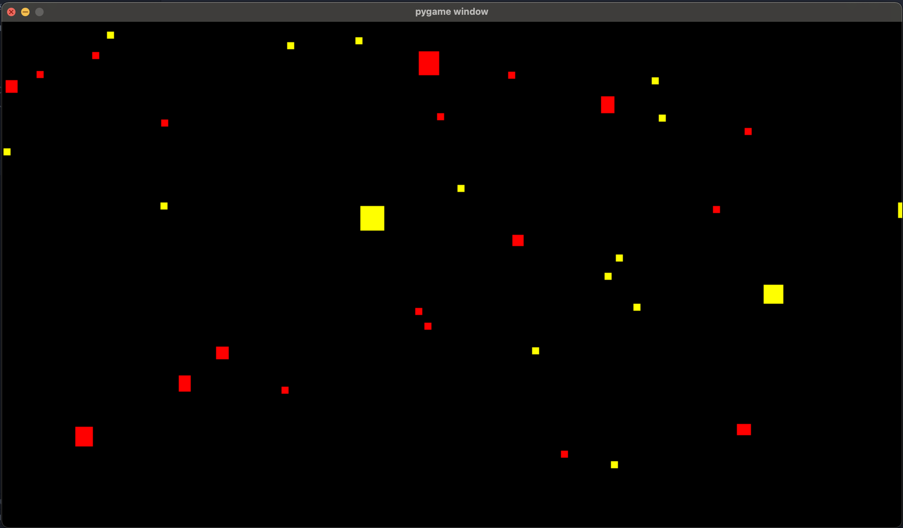
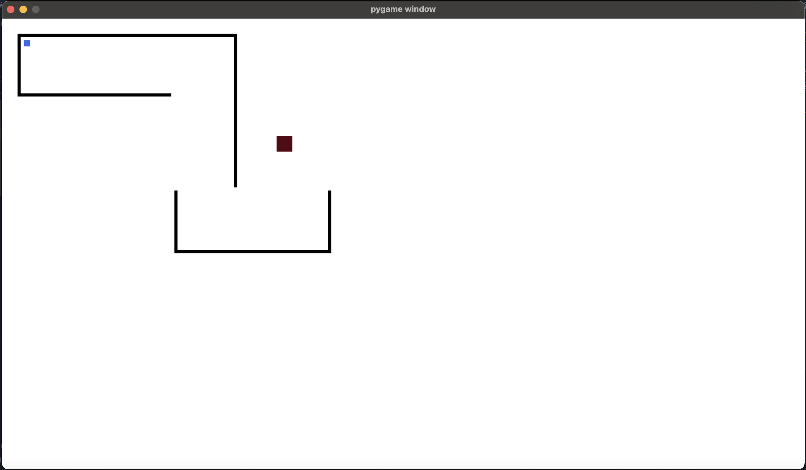

<p align="center">
    
    
</p>

# 🤖 aisim

Simulation environment for any AI system.

## Usage

See ```__main__.py``` for the implemenable functions:

```
on_load() - Runs only once at the beggining.
on_behave() - Runs in each behave loop.
on_perceive() - Runs in each perceive loop.
```

After implementation you can run your own ```__main__.py``` file with:

```$ python .```

Or you can run examples from the  ```examples``` directory.

## Tests

TODO

## Authors

* **[Martin Kondor](https://github.com/MartinKondor)**


## License 

Copyright &copy; Martin Kondor 2022.

See [LICENSE](./LICENSE) file for more information.
